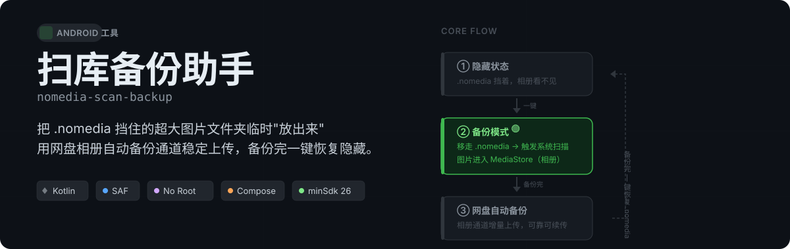

<p align="center">
  
</p>

---

## 这是什么

很多手机的**「文件管理」类 App**（微信、相机、截图）会在自己文件夹里放一个 `.nomedia` 文件，系统媒体扫描器会跳过这个文件夹——图片不会进系统相册。

如果你要把这些图片备份到网盘（百度网盘、Google Photos、阿里云盘等），**文件夹备份不稳定、易断、无法续传**；**相册自动备份**才是稳的——增量、可续传、断点续传。

**扫库备份助手**就是做这件事的：临时把 `.nomedia` 移走，触发系统重扫，让图片进入相册；备份完成后一键恢复 `.nomedia`，图片从相册隐回。

> 适用场景：手机里有一个 100G+ 的图片文件夹（含 `.nomedia`），走文件夹备份总是断，改走相册通道。

---

## 为什么这样做

- **删掉 `.nomedia` 本身不会触发重扫**——必须主动调用 `MediaScannerConnection` 告诉系统"这文件夹里有新内容"。
- **`.nomedia` 对子目录递归生效**——所以只需要管理根部这一个文件，无需逐层处理。
- 图片进入系统相册后，网盘的**「相册自动备份」**通道走的是 MediaStore 增量订阅，比整目录扫描稳定得多。

---

## 工作流程

| 阶段 | 操作 | 说明 |
|------|------|------|
| **进入备份模式** | 根部 `.nomedia` → 重命名为 `.nomedia.bak` | 一次性 SAF 文件夹授权即可 |
| | 触发 `MediaScannerConnection.scanFile()` | 系统开始扫描该目录 |
| | 图片出现在系统相册 | ✅ 打开网盘 → 开**相册自动备份** |
| **退出备份模式** | `.nomedia.bak` → 改回 `.nomedia`（或新建） | 一键恢复 |
| | 触发第二次系统扫描 | 图片从相册移出，对其他 App 不可见 |

---

## 权限设计（尽量往低了做）

| 能力 | 依赖 | 额外说明 |
|------|------|----------|
| 读写 `.nomedia` | **SAF 文件夹授权**（`OPEN_DOCUMENT_TREE`） | 一次性授权，**无需**"所有文件访问" |
| 触发系统扫描 | `MediaScannerConnection` | 系统 API，不需要任何权限 |
| 显示"已入库 N 张"进度 | **可选** `READ_MEDIA_IMAGES / VIDEO` | 不给这个权限也能正常使用，只是看不到计数 |

不需要 Shizuku、不需要 Root、不需要 `MANAGE_EXTERNAL_STORAGE`。

---

## 技术栈

```
语言        Kotlin
UI          Jetpack Compose (Material3)
最低 SDK    minSdk 26
目标 SDK    targetSdk 34
构建        Gradle 8.14 + AGP 8.2.2
目标机型    HyperOS 3 及其它使用主线 MediaProvider 的现代安卓
```

---

## 构建

CI（GitHub Actions）在 push 到 `main` 时自动构建 debug APK（Artifact），打 tag（如 `v0.0.1-beta`）时创建 Release 并附上可直接侧载的 APK。

本地构建：

```bash
cd android
./gradlew assembleDebug
# 产物：android/app/build/outputs/apk/debug/nomedia-backup-*-debug.apk
```

---

## 关键代码

| 文件 | 职责 |
|------|------|
| `NomediaManager.kt` | SAF 下对 `.nomedia` 的重命名 / 新建 / 删除，以及从 tree URI 推导真实路径 |
| `SystemScanner.kt` | 目录级系统扫描（主）+ 逐文件深度扫描（兜底）+ MediaStore 计数进度 |
| `MainActivity.kt` | Compose 单屏 UI 与状态机 |

---

## 提示

- **首次扫描 150G 大文件夹可能需要几十分钟**——属正常现象，之后增量扫描很快。
- 备份期间图片会出现在系统相册、**对所有 App 可见**，退出备份模式后隐回。
- 若子目录里也各自有 `.nomedia`，那些子目录仍会被系统跳过；本工具**默认只管根部那一份**。

---

## License

MIT
